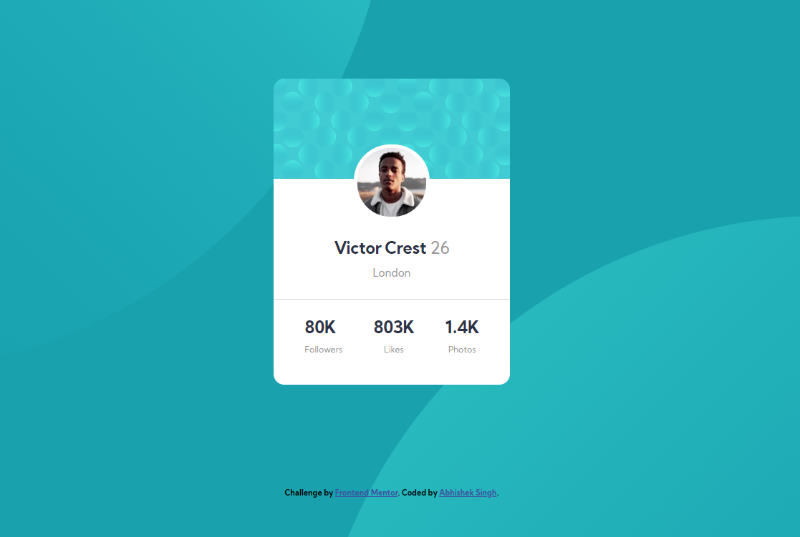

# Frontend Mentor - Profile card component solution

This is a solution to the [Profile card component challenge on Frontend Mentor](https://www.frontendmentor.io/challenges/profile-card-component-cfArpWshJ). Frontend Mentor challenges help you improve your coding skills by building realistic projects. 

## Table of contents

- [Overview](#overview)
  - [The challenge](#the-challenge)
  - [Screenshot](#screenshot)
  - [Links](#links)
- [My process](#my-process)
  - [Built with](#built-with)
  - [What I learned](#what-i-learned)
  - [Continued development](#continued-development)
- [Author](#author)


**Note: Delete this note and update the table of contents based on what sections you keep.**

## Overview

### The challenge

- Build out the project to the designs provided

### Screenshot



### Links

- Solution URL: [Github Repository](https://github.com/abhisheksinghwork7/Profile-card-component)
- Live Site URL: [Vercel Site](https://profile-card-component-eight-mu.vercel.app/)

## My process

### Built with

- Semantic HTML5 markup
- CSS custom properties
- Flexbox
- Mobile-first workflow


### What I learned

I cleared a lot og basic idea about padding and margins. I had to really study the basics to place 2 background images with custom setting. The css code for the same is given below: 
```css
 background-image: url("/images/bg-pattern-top.svg"), url("/images/bg-pattern-bottom.svg")  ;
    background-repeat: no-repeat,no-repeat;
    background-size: cover,cover;
    background-position: top -60vh left -120vw ,bottom -60vh right -120vw;
```


### Continued development

I found that there is need to study the properties and basic attributes of HTML5. The behaviour of each attributes and the values given does help in defing the page better.


## Author

- Frontend Mentor - [@abhisheksingh7](https://www.frontendmentor.io/profile/abhisheksinghwork7)


